<picture>
  <source media="(prefers-color-scheme: dark)" srcset="./profile-summary-card-output/discord_old_blurple/3-stats.svg">
  <source media="(prefers-color-scheme: light)" srcset="./profile-summary-card-output/nord_bright/3-stats.svg">
  
</picture>

<picture>
  <source media="(prefers-color-scheme: dark)" srcset="https://readme-typing-svg.demolab.com?font=Fira+Code&size=28&duration=2500&pause=1800&color=22D3EE&width=450&lines=Hi%2C+I%27m+MenGrey%21+%F0%9F%91%8B">
  <source media="(prefers-color-scheme: light)" srcset="https://readme-typing-svg.demolab.com?font=Fira+Code&size=28&duration=2500&pause=1800&color=0891B2&width=450&lines=Hi%2C+I%27m+MenGrey%21+%F0%9F%91%8B">
  
</picture>

SJTU student interested in **RO/CV/ML**.

Currently exploring **Embodied AI**.

Always happy to discuss ideas and collaborate.

📫 wupeiqin@sjtu.edu.cn

 
